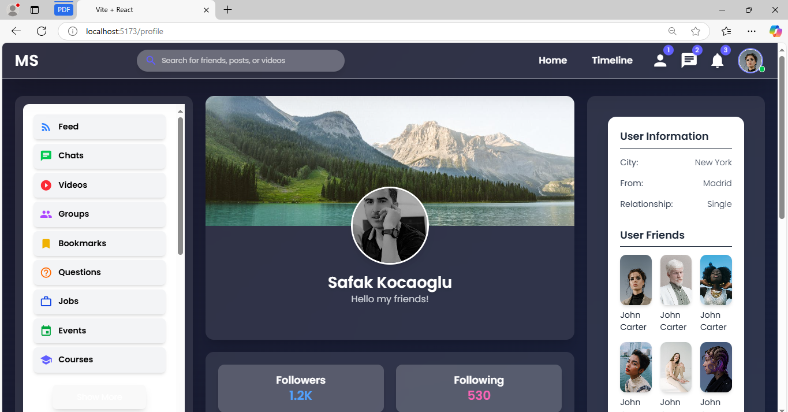
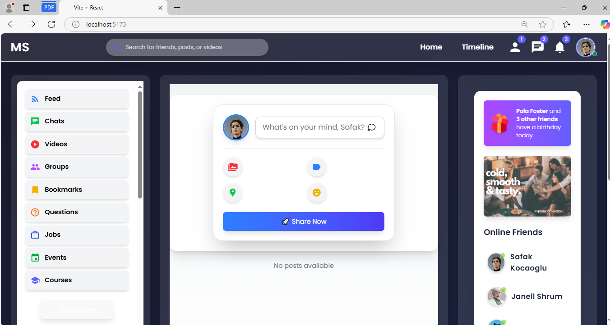
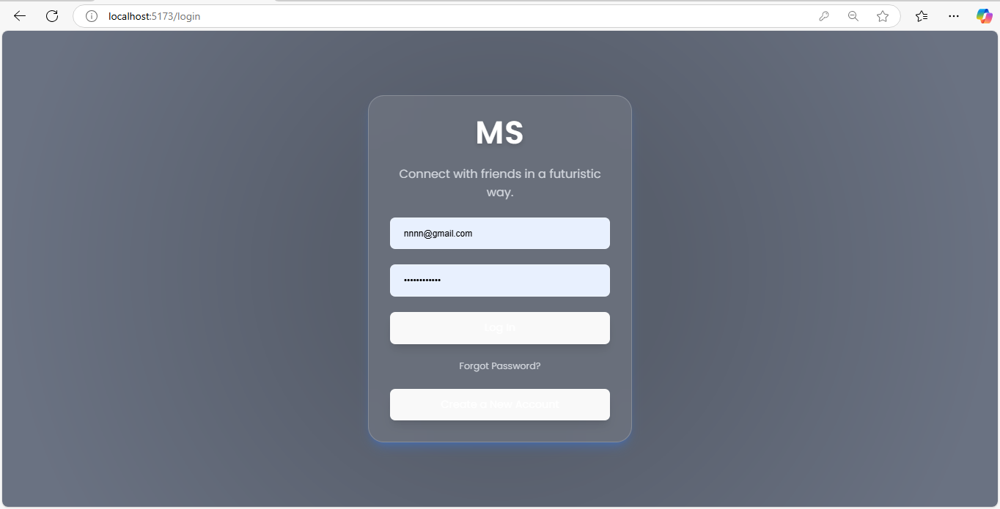

# Social Media Web App

## Description
This is a social media web application built with a Node.js and Express backend and a React frontend. The application allows users to interact with each other, share posts, and manage their profiles seamlessly. Users can create accounts, log in, and engage with content through likes, comments, and shares. The application also features a responsive design, ensuring a smooth experience across various devices. With a focus on user experience, it leverages modern technologies such as MongoDB for data storage and Vite for fast frontend development. This project aims to provide a platform for users to connect and share their thoughts and experiences in a vibrant online community.

## Screenshots
### profile page

### Home Page


### Login Page



## Installation Instructions

### Backend
1. Navigate to the `backend` directory:
   ```bash
   cd social-media-app/backend
   ```
2. Install the dependencies:
   ```bash
   npm install
   ```

### Frontend
1. Navigate to the `frontend` directory:
   ```bash
   cd social-media-app/frontend
   ```
2. Install the dependencies:
   ```bash
   npm install
   ```

## Usage

### Backend
To start the backend server, run:
```bash
npm run dev
```

### Frontend
To start the frontend development server, run:
```bash
npm run dev
```

## Scripts
- **Backend:**
  - `dev`: Starts the backend server with nodemon.
  
- **Frontend:**
  - `dev`: Starts the Vite development server.
  - `build`: Builds the frontend for production.
  - `lint`: Lints the frontend code with ESLint.
  - `preview`: Previews the production build.

## Dependencies
### Backend
- Express
- Mongoose
- Bcrypt
- Cookie-parser
- CORS
- Dotenv
- Helmet
- Morgan
- Nodemon

### Frontend
- React
- React Router
- Axios
- Material UI
- Tailwind CSS
- Vite

## Author
Muhammad Shakeel
